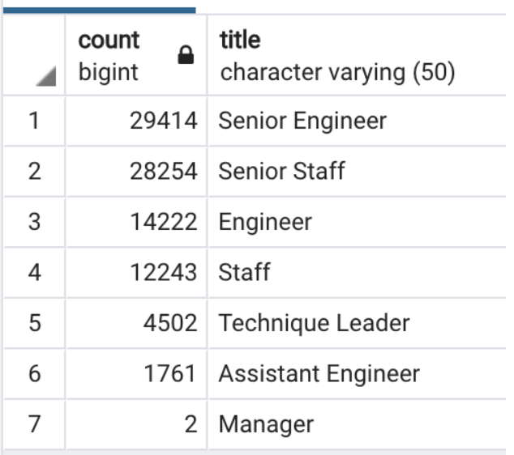
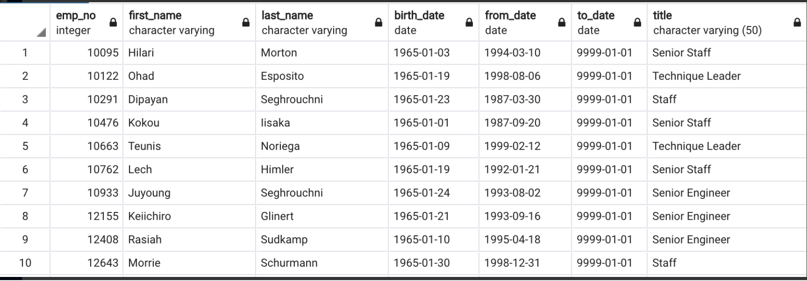

# Pewlett-Hackard-Analysis

## Overview
By using SQL data base related knowledge, we have filtered out the tables for determining the number of retiring employees with their titles and the eligible employees for the mentorship program hold by the company. We could easily analyze the two tables to have good suggestions based on the real situation.

## Analysis based on two tables

|Retiring Employees number per department          |Eligible Employees for Mentorship Program                |
|:----------:                                      |                                :-----------------------:|
|                                   |                                          |
* We can see that there are 29414 senior engineers and 28254 senior staffs are at their retire age. The company needs a surgent hiring plan for the positions left otherwise it has potenital effect for the company in the future.
* For department manager level, there are 2 managers at the retire age.
* There are totally 1549 eligible employees for mentorship program in the company.
* There are 569 senior staffs and 169 senior engineers eligible for mentorship program which could provide more valuable suggestions to the new emloyees in the company.

## Summary
There are totally 90398 roles needed to be filled as the "Silver tsunami" begins to make an impact. The urgent hiring plan should be put on the schedule as soon as possbile to aviod unnecessary loss due to the "Silver Tsunami". On the other side, there are not enough mentors for the next generation of PH company unfortunately. There would be 90398 new employees while there are only 1549 mentors. One mentor has to get connected with about 6 to 7 new employees to fulfill the gap. We need at least one time more number of current mentors avaible.
Overall, Pewlett Hackard needs to do at least two things to ensure the future success that the first thing is to begin hiring process as soon as possbile to fuifill the 90398 positions. In addition, the company better to adjust the reqiurement for being a eligible mentor to have more candidate in the pool to get connected with a large number of the next generation.
